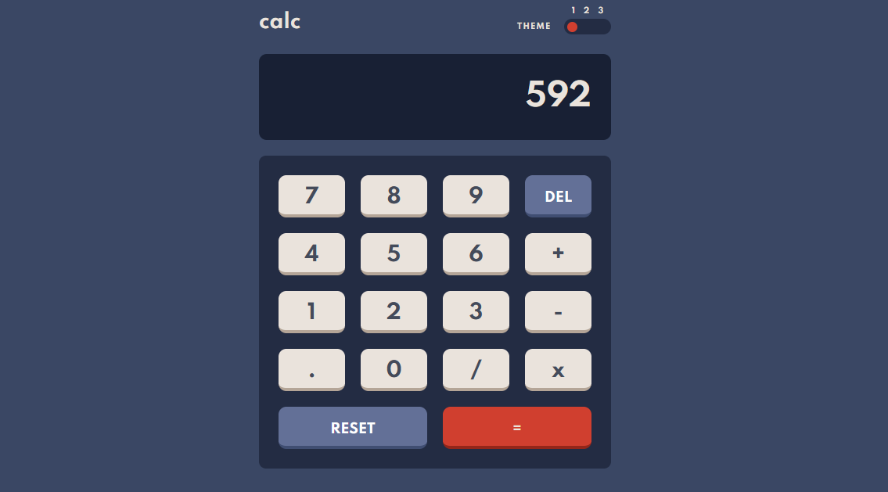

# Calculator app solution - Frontend Mentor

This is a solution to the [Calculator app challenge on Frontend Mentor](https://www.frontendmentor.io/challenges/calculator-app-9lteq5N29).

## Table of contents

- [Overview](#overview)
  - [The challenge](#the-challenge)
  - [Screenshot](#screenshot)
  - [Links](#links)
- [My process](#my-process)
  - [Built with](#built-with)
  - [What I learned](#what-i-learned)
  - [Continued development](#continued-development)
  - [Useful resources](#useful-resources)
- [Author](#author)

**Note: Delete this note and update the table of contents based on what sections you keep.**

## Overview

### The challenge

Users should be able to:

- See the size of the elements adjust based on their device's screen size
- Perform mathmatical operations like addition, subtraction, multiplication, and division
- Adjust the color theme based on their preference
- **Bonus**: Have their initial theme preference checked using `prefers-color-scheme` and have any additional changes saved in the browser

### Screenshot



### Links

- Solution URL: [github.com/PabloTachella/calculator-app-main](https://github.com/PabloTachella/calculator-app-main)
- Live Site URL: [pablotachella.github.io/calculator-app-main/](https://pablotachella.github.io/calculator-app-main/)

## My process

### Built with

- Semantic HTML5 markup
- Methodology BEM
- Flexbox
- CSS Grid
- CSS media queries
- Vanilla JS

**Note: The JS code does not cover the entire flow in a calculator, but it does solve recurring situations**

### What I learned

In this challenge I implemented the BEM methodology (b-block__element_mod), with which you completely forget about specificity problems.
b- prefix stands for “block” and is the default in many BEM implementations.
```html
<h1 class="b-head__title">calc</h1>

<body class="b-body_theme_blue"> 
```
Even when manipulating the DOM with JS, BEM can provide us with a unique class name or not (depending on the use case) with which to access the HTML elements without the need to assign an ID

```js
// alternative to get an element from the DOM
// the BEM methodology allows to know which element is being brought
const screenContainer = document.getElementsByClassName('b-screen')[0]
```

### Continued development

Completing this challenge helped me put into practice various knowledge and motivated me to continue doing practical exercises to face new challenges and have a better portfolio.

### Useful resources

- [www.smashingmagazine.com/2014/07/bem-methodology-for-small-projects/](https://www.smashingmagazine.com/2014/07/bem-methodology-for-small-projects/) - this helped me for reasons already mentioned. I really liked this methodology and will use it going forward.
- [marabelia.com/css-font-size-responsive/](https://marabelia.com/css-font-size-responsive/) - in addressing EM's scalable unit of measure, they helped me find an alternative to manipulate the font-size from JS which affects any screen size.

## Author

- Website - [Pablo Tachella](https://pablotachella.github.io/)
- Platzi Profile - [@PabloTachella](https://platzi.com/p/tachella/)